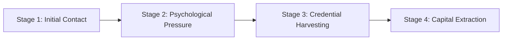
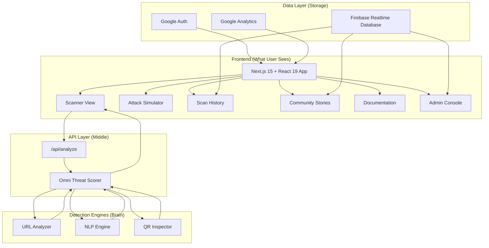

# 📖 ScamShield AI — Complete Technical Documentation

> **IEEE VIT Bhopal Hackathon 2026 · Track 04 Cybersecurity**
> **Problem Statement 04.1: "The Scam That Almost Worked"**
> **Team D43M0N$**

---

## Table of Contents

1. [What is ScamShield AI?](#1-what-is-scamshield-ai)
2. [The Problem We're Solving](#2-the-problem-were-solving)
3. [How It Works (Simple Explanation)](#3-how-it-works-simple-explanation)
4. [Architecture Overview](#4-architecture-overview)
5. [The 3 Detection Engines](#5-the-3-detection-engines)
6. [All Features Explained](#6-all-features-explained)
7. [Tech Stack Breakdown](#7-tech-stack-breakdown)
8. [File-by-File Code Guide](#8-file-by-file-code-guide)
9. [Benchmark Results (98% Accuracy)](#9-benchmark-results-98-accuracy)
10. [How to Run the App](#10-how-to-run-the-app)
11. [Indian Legal Framework & Helplines](#11-indian-legal-framework--helplines)
12. [Team Members & Roles](#12-team-members--roles)
13. [Glossary for Beginners](#13-glossary-for-beginners)

---

## 1. What is ScamShield AI?

ScamShield AI is a **real-time phishing link and QR code threat analyzer** — a web application that helps ordinary Indian citizens check if a link, SMS message, or QR code they received is a **scam** or **legitimate**, *before* they click on it.

### In Simple Words:
> Imagine your grandmother receives an SMS saying "Your electricity will be disconnected tonight. Click this link to pay." ScamShield AI lets her (or you) paste that message, and within 2 seconds, it tells her:
> - ❌ "This is a SCAM — the message uses fear tactics and the link is fake"
> - ✅ "This is SAFE — this is an official bank notification"

### Why It Matters:
- India lost **₹11,333 crore to cyber fraud** in 2023 (RBI Annual Report)
- **47% of scams** use fake UPI QR codes or phishing links
- Most victims are **non-technical users** who can't distinguish real from fake
- There is **no pre-click protection** — all existing tools work *after* money is lost

### Our Core Innovation:
**Pre-Click Zero-Trust Protection** — We analyze threats *before* the user clicks, not after. We assume every link is guilty until proven innocent (Zero-Trust).

---

## 2. The Problem We're Solving

### IEEE Problem Statement 04.1: "The Scam That Almost Worked"

The problem describes a **4-stage cyber attack** that targets Indian citizens:



| Stage | What Happens | Real Example |
|-------|-------------|--------------|
| **1. Initial Contact** | Victim receives SMS/WhatsApp from unknown number | "Dear SBI User, your YONO account is blocked" |
| **2. Psychological Pressure** | Message creates fear & urgency | "Update KYC within 24 hours or ₹5,000 fine" |
| **3. Credential Harvesting** | Victim clicks fake link that looks like real bank | `sbl-kyc-update.xyz` (looks like SBI but is fake) |
| **4. Capital Extraction** | Scammer steals UPI PIN/OTP, transfers money | Irreversible ₹50,000 UPI transfer |

### What ScamShield Does:
We intercept at **Stage 2-3** — *before* the victim enters any credentials or scans any QR code.

---

## 3. How It Works (Simple Explanation)

ScamShield has **3 scanning modes**. Think of them as 3 security guards, each checking a different thing:

### 🔗 Guard 1: Website Link Scanner
**What it checks:** When you paste a URL like `http://sbl-kyc-update.xyz/login.php`

It looks for:
- Is the domain name misspelling a real brand? (SBI → SBL = typosquatting!)
- Is it using a suspicious domain ending? (.xyz, .top, .buzz = high risk)
- Is it using a raw IP address instead of a name? (Like `192.168.10.55`)
- Does the URL contain scary words? (kyc, blocked, verify, urgent)
- Is it using HTTPS (secure) or HTTP (insecure)?
- Is the domain new (less than 7 days old)?

### 💬 Guard 2: SMS/Message NLP Analyzer
**What it checks:** When you paste a text message (works in **English, Hindi, and Hinglish**)

It looks for:
- **Urgency triggers:** "immediately", "तुरंत", "24 hours", "आज रात"
- **Fear tactics:** "blocked", "suspended", "काट दी जाएगी"
- **Authority impersonation:** Is it pretending to be SBI? RBI? Electricity Board? TRAI?
- **Scam category:** Is this a KYC fraud? Digital arrest? Lottery bait? Job scam?

### 📱 Guard 3: QR Code & UPI Inspector
**What it checks:** When you paste or upload a QR code image

It looks for:
- **Reverse-charge scam:** QR says "Scan to receive ₹5,000 cashback" but actually *debits* your money
- **VPA masquerade:** Claims to be "Electricity Department" but money goes to `randomguy@ybl` (personal account)
- **Malware links:** QR contains a link to download a `.apk` virus
- **Hardcoded high amounts:** QR has ₹5,000+ pre-filled

---

## 4. Architecture Overview



### How Data Flows:
1. User pastes a link/message/QR in the **Scanner View**
2. Frontend sends a POST request to `/api/analyze`
3. The API runs the appropriate **Detection Engine** (URL/NLP/QR)
4. The **Omni Threat Scorer** combines all results into a single risk score
5. Results are displayed with a color-coded verdict card
6. Scan is saved to **Firebase Realtime Database** (if user is logged in)

---

## 5. The 3 Detection Engines

### Engine 1: URL Analyzer ([urlAnalyzer.ts](file:///home/z/Downloads/psychic-octo-meme-main/lib/analyzers/urlAnalyzer.ts))

This is a **heuristic scoring engine** that assigns points to suspicious URL characteristics:

| Check | Points Added | What It Detects |
|-------|-------------|-----------------|
| Raw IP as hostname | +45 | `http://192.168.10.55/icici/login` |
| Homograph/Punycode attack | +40 | Unicode chars that look like English |
| Suspicious TLD | +25 | `.xyz`, `.top`, `.buzz`, `.club`, etc. |
| Excessive subdomains | +20 | `login.secure.bank.sbi.fake.xyz` |
| Brand impersonation | +45 | URL contains "sbi" but isn't `sbi.co.in` |
| Phishing keywords | +10-30 | "kyc", "verify", "blocked", "otp" |
| No HTTPS | +25 | `http://` instead of `https://` |
| New domain | +25 | Domain created less than 7 days ago |
| **Official domain detected** | **-50** | Verified: `onlinesbi.sbi`, `hdfcbank.com` |

**Risk Tiers:**
- Score 0-29 → ✅ SAFE
- Score 30-64 → ⚠️ SUSPICIOUS
- Score 65-100 → ❌ HIGH_RISK

**Brands Protected:** SBI, HDFC, ICICI, PNB, Paytm, PhonePe, Google Pay, BESCOM, India Post, RBI, TRAI

---

### Engine 2: NLP (Natural Language Processing) Engine ([nlpEngine.ts](file:///home/z/Downloads/psychic-octo-meme-main/lib/analyzers/nlpEngine.ts))

This engine analyzes the **text content** of SMS/WhatsApp messages.

**Step 1: Language Detection**
```
Hindi: Uses Devanagari script (Unicode range \u0900-\u097F)
Hinglish: Contains romanized Hindi words like "turant", "jayega", "bijli"
English: Default
Mixed: Both Devanagari + English characters
```

**Step 2: Urgency Scoring** (Panic words with weighted points)

| Trigger Word | Points | Language |
|-------------|--------|----------|
| "within 24 hours" | 35 | English |
| "काट दी जाएगी" (will be cut) | 35 | Hindi |
| "antim chetavani" (final warning) | 35 | Hinglish |
| "blocked" | 30 | English |
| "aaj raat" (tonight) | 30 | Hinglish |
| "तुरंत" (immediately) | 25 | Hindi |

**Step 3: Authority Impersonation Detection**

Detects if message pretends to be from: SBI/YONO, RBI, Electricity Board, TRAI, India Post, Police/CBI, HDFC, Income Tax

**Step 4: Scam Category Classification**

| Category | Example Pattern |
|----------|----------------|
| `KYC_EXPIRY_FRAUD` | "kyc", "pan card update", "account block" |
| `ELECTRICITY_UTILITY_SCAM` | "bijli kat", "power disconnected", "बिजली बिल" |
| `REVERSE_UPI_COLLECT` | "scan to receive", "enter pin to get" |
| `DIGITAL_ARREST_IMPERSONATION` | "CBI", "digital arrest", "narcotics" |
| `JOB_TASK_FRAUD` | "earn per day", "like youtube videos" |
| `LOTTERY_REWARD_BAIT` | "KBC lottery", "won crore", "lucky winner" |
| `LEGITIMATE_NOTIFICATION` | "debited by", "credited by" (no links/urgency) |

**Composite Score Formula:**
```
compositeNlpScore = (urgencyScore × 0.45) + (impersonationScore × 0.45) + (triggerCount × 5)
```

---

### Engine 3: QR Code & UPI Inspector ([qrInspector.ts](file:///home/z/Downloads/psychic-octo-meme-main/lib/analyzers/qrInspector.ts))

Parses UPI intent URIs and checks for fraud patterns.

**UPI URI Format:** `upi://pay?pa=payee@bank&pn=Name&am=Amount&tn=Note`

| Parameter | Meaning | Example |
|-----------|---------|---------|
| `pa` | Payee VPA (UPI address) | `scammer89@ybl` |
| `pn` | Payee Name | `SBI Refund Dept` |
| `am` | Amount | `5000` |
| `tn` | Transaction Note | `Scan to Receive Cashback` |

**Critical Detection: Reverse-QR Scam**
> 🚨 In UPI, **you NEVER scan a QR to RECEIVE money**. Scanning a QR always DEBITS. If the note says "Receive" or "Cashback" or "Refund" — it's a 100% scam.

**VPA Masquerade Detection:**
- Name claims "Electricity Department" but VPA is `randomguy@ybl` (personal handle)
- Personal handles: `@okhdfcbank`, `@okaxis`, `@oksbi`, `@ybl`, `@paytm`

---

### The Omni Threat Scorer ([threatScorer.ts](file:///home/z/Downloads/psychic-octo-meme-main/lib/analyzers/threatScorer.ts))

Combines all 3 engines into a **single unified threat report**:

```
overallScore = (messageScore × 0.40) + (urlScore × 0.35) + (qrScore × 0.35)
```

Generates 5 security metrics:
1. **Domain Trust** (0-100): How trustworthy is the domain?
2. **Protocol Security** (0-100): Is encryption in place?
3. **Linguistic Urgency** (0-100): How much panic does the message create?
4. **Impersonation Risk** (0-100): Is someone pretending to be an authority?
5. **Zero-Trust Score** (0-100): Overall trust level (100 = fully verified)

---

## 6. All Features Explained

### Feature 1: Threat Scanner (Main Feature)
- **3 scanning modes:** URL, Message, QR
- **4 preset demo cards** for quick hackathon testing
- **Real-time analysis** with animated forensic pipeline UI
- **Color-coded verdict cards** (Red/Amber/Green)
- **Bilingual explanations** in English and Hindi
- Results saved to Firebase automatically

### Feature 2: Attack Simulator
- Visual walkthrough of the **4-stage scam anatomy**
- Shows exactly where ScamShield intercepts the attack
- Educational tool for understanding how scams work

### Feature 3: Scan History
- Personal vault of all previous scans
- Synced to **Firebase Realtime Database** via WebSocket
- Filter by: All Scans, Scams Blocked, Verified Safe
- One-click re-inspect from history
- Also saved to **localStorage** for offline access

### Feature 4: Community Scam Stories
- Citizens share real scam experiences
- Categories: UPI Fraud, Phishing Link, Electricity Bill, WhatsApp Call, Job Scam, Customs Parcel
- Like/Helpful voting system
- Admin verification badges

### Feature 5: Documentation View
- In-app documentation with downloadable `.docx` and `.md` files
- Covers architecture, engines, benchmarks, legal framework

### Feature 6: About Team
- Team member profiles with roles

### Feature 7: Admin Console
- User account management
- Threat scan log monitoring
- Stories moderation (verify/delete)
- Role management (admin/analyst/citizen)

### Feature 8: AI Advisor Modal
- Slide-over panel for cybersecurity guidance
- Context-aware help

### Feature 9: Multi-Language Support
- Complete English and Hindi translations
- All UI labels, placeholders, results available in both languages

### Feature 10: 5 Color Themes
1. ⚪ **Clean Light** — Default white theme
2. 🟢 **Glass Mint** — Calming green theme
3. 🟣 **Lavender Frost** — Purple theme
4. 🟡 **Solar Amber** — Warm yellow theme
5. ⚫ **Obsidian Dark** — Dark cybersecurity terminal theme

### Feature 11: QR Image Reader
- Upload any QR code image (PNG, JPG)
- Client-side decoding using `jsQR` library
- No server upload needed (privacy preserved)
- Drag & drop or file picker

### Feature 12: Google Authentication
- Sign in with Google account
- Scan history synced across devices
- User profile stored in Firebase

### Feature 13: Live Threat Intelligence Stream
- Dedicated real-time telemetry stream listening to Firebase RTDB (`threat_reports`)
- Live threat event feed displaying newly reported scam links, SMS traps, and reverse-charge UPI VPAs
- Animated live status ticker and active event counters
- Quick threat inspect action to re-run live IOCs through Scanner

### Feature 14: SecOps Threat Broadcaster (Admin Console)
- Authoritative broadcasting console for security analysts and administrators
- Dispatch emergency warnings to all citizen dashboards nationwide in real-time
- Configure custom attack titles, target indicators (URLs, phone VPAs, QR links), anomaly tags, and actionable Zero-Trust defense playbooks
- Instant synchronized push to RTDB (`threat_reports` and active alerts)

### Feature 15: Sovereign Scan History Governance & Role-Based Deletion
- **Zero-Trust Audit Integrity:** Unauthenticated guest users cannot delete scan records to prevent anti-forensic tampering
- **Citizen Self-Ownership:** Authenticated logged-in users hold sovereign ownership to selectively delete or clear their own scan history (`deleteUserScanRecord` / `clearUserOwnScans`)
- **SecOps Admin Purge:** Administrators hold authoritative platform-wide deletion privileges (`deleteAllScanHistories`) to moderate or wipe RTDB telemetry


---

## 7. Tech Stack Breakdown

### For Complete Beginners — What Each Technology Does:

| Technology | What It Is | Why We Use It |
|-----------|-----------|---------------|
| **Next.js 15** | A framework for building web apps | Gives us server-side rendering, API routes, and fast page loads |
| **React 19** | A library for building UI | Lets us create interactive components |
| **TypeScript 5.8** | JavaScript with types | Catches bugs before runtime |
| **Tailwind CSS** | A utility CSS framework | Makes styling fast with class names |
| **Firebase Realtime Database** | A cloud database by Google | Stores scans, stories, and user data with live sync |
| **Firebase Auth** | Google authentication | Lets users sign in with their Google account |
| **Firebase Analytics** | Usage tracking | Tracks how people use the app |
| **jsQR** | QR code decoder library | Reads QR codes from uploaded images |
| **Lucide React** | Icon library | Provides all the icons in the UI |

### Package Dependencies ([package.json](file:///home/z/Downloads/psychic-octo-meme-main/package.json)):
- `next` — Web framework
- `react` / `react-dom` — UI library
- `firebase` — Backend services (database, auth, analytics)
- `jsqr` — Client-side QR code reading
- `lucide-react` — Icon components
- `tailwindcss` — CSS framework
- `typescript` — Type-safe JavaScript

---

## 8. File-by-File Code Guide

### 📁 Root Files

| File | Purpose |
|------|---------|
| [package.json](file:///home/z/Downloads/psychic-octo-meme-main/package.json) | Lists all dependencies and scripts (`npm run dev`) |
| [tsconfig.json](file:///home/z/Downloads/psychic-octo-meme-main/tsconfig.json) | TypeScript configuration |
| [tailwind.config.ts](file:///home/z/Downloads/psychic-octo-meme-main/tailwind.config.ts) | Tailwind CSS configuration with custom theme tokens |
| [next.config.mjs](file:///home/z/Downloads/psychic-octo-meme-main/next.config.mjs) | Next.js configuration |

### 📁 `app/` — Next.js App Router

| File | Purpose |
|------|---------|
| [page.tsx](file:///home/z/Downloads/psychic-octo-meme-main/app/page.tsx) | **Main page** — Controls all tab navigation, auth state, theme switching |
| [layout.tsx](file:///home/z/Downloads/psychic-octo-meme-main/app/layout.tsx) | Root HTML layout with metadata and fonts |
| [globals.css](file:///home/z/Downloads/psychic-octo-meme-main/app/globals.css) | All CSS variables for 5 themes, animations, glassmorphism |

### 📁 `app/api/` — Server-Side API Routes

| File | Purpose |
|------|---------|
| [analyze/route.ts](file:///home/z/Downloads/psychic-octo-meme-main/app/api/analyze/route.ts) | **Core API** — Receives scan requests, runs detection engines, saves to Firebase |
| [benchmark/route.ts](file:///home/z/Downloads/psychic-octo-meme-main/app/api/benchmark/route.ts) | Runs the 100-sample benchmark test suite |
| [reports/route.ts](file:///home/z/Downloads/psychic-octo-meme-main/app/api/reports/route.ts) | Fetches recent threat reports from Firebase |

### 📁 `lib/analyzers/` — Detection Engine Core

| File | Purpose |
|------|---------|
| [urlAnalyzer.ts](file:///home/z/Downloads/psychic-octo-meme-main/lib/analyzers/urlAnalyzer.ts) | **Engine 1** — URL heuristic analysis (typosquatting, TLDs, brand impersonation) |
| [nlpEngine.ts](file:///home/z/Downloads/psychic-octo-meme-main/lib/analyzers/nlpEngine.ts) | **Engine 2** — Multilingual NLP message analysis (urgency, impersonation, categories) |
| [qrInspector.ts](file:///home/z/Downloads/psychic-octo-meme-main/lib/analyzers/qrInspector.ts) | **Engine 3** — QR code & UPI intent analysis (reverse-charge scam, VPA masquerade) |
| [threatScorer.ts](file:///home/z/Downloads/psychic-octo-meme-main/lib/analyzers/threatScorer.ts) | **Omni Scorer** — Combines all 3 engines into unified threat report |
| [dataset.ts](file:///home/z/Downloads/psychic-octo-meme-main/lib/analyzers/dataset.ts) | **Benchmark** — 100 test samples (50 scam + 50 legit) with accuracy metrics |

### 📁 `lib/` — Utilities

| File | Purpose |
|------|---------|
| [firebase.ts](file:///home/z/Downloads/psychic-octo-meme-main/lib/firebase.ts) | Firebase initialization, all CRUD operations for reports, scans, stories, users |
| [i18n.ts](file:///home/z/Downloads/psychic-octo-meme-main/lib/i18n.ts) | English + Hindi translations dictionary (300+ translation keys) |
| [qrDecoder.ts](file:///home/z/Downloads/psychic-octo-meme-main/lib/qrDecoder.ts) | Client-side QR image decoding using jsQR + HTML5 Canvas |

### 📁 `components/` — React UI Components

| Component | Purpose |
|-----------|---------|
| [ScannerView.tsx](file:///home/z/Downloads/psychic-octo-meme-main/components/ScannerView.tsx) | **Main scanner** — Input fields, preset cards, analysis trigger, verdict display |
| [AttackSimulator.tsx](file:///home/z/Downloads/psychic-octo-meme-main/components/AttackSimulator.tsx) | 4-stage scam anatomy visualization |
| [HistoryView.tsx](file:///home/z/Downloads/psychic-octo-meme-main/components/HistoryView.tsx) | User's scan history with filters and re-inspect |
| [SocialView.tsx](file:///home/z/Downloads/psychic-octo-meme-main/components/SocialView.tsx) | Community scam stories wall |
| [DocumentationView.tsx](file:///home/z/Downloads/psychic-octo-meme-main/components/DocumentationView.tsx) | In-app documentation with downloads |
| [AboutView.tsx](file:///home/z/Downloads/psychic-octo-meme-main/components/AboutView.tsx) | Team member profiles |
| [AdminView.tsx](file:///home/z/Downloads/psychic-octo-meme-main/components/AdminView.tsx) | Admin operations console |
| [Sidebar.tsx](file:///home/z/Downloads/psychic-octo-meme-main/components/Sidebar.tsx) | Collapsible navigation sidebar with theme switcher |
| [TopHeader.tsx](file:///home/z/Downloads/psychic-octo-meme-main/components/TopHeader.tsx) | Top header with greeting and status |
| [AiAdvisorModal.tsx](file:///home/z/Downloads/psychic-octo-meme-main/components/AiAdvisorModal.tsx) | AI cybersecurity advisor slide-over |
| [TelemetryBenchmark.tsx](file:///home/z/Downloads/psychic-octo-meme-main/components/TelemetryBenchmark.tsx) | Benchmark results visualization |
| [QuickActionGrid.tsx](file:///home/z/Downloads/psychic-octo-meme-main/components/QuickActionGrid.tsx) | Quick action cards grid |
| [TwoColumnSection.tsx](file:///home/z/Downloads/psychic-octo-meme-main/components/TwoColumnSection.tsx) | Two-column layout with threat stream + defense engines |
| [ProjectDossier.tsx](file:///home/z/Downloads/psychic-octo-meme-main/components/ProjectDossier.tsx) | Project overview dossier |
| [ViewSkeleton.tsx](file:///home/z/Downloads/psychic-octo-meme-main/components/ViewSkeleton.tsx) | Loading skeleton placeholders for lazy-loaded views |

---

## 9. Benchmark Results (98% Accuracy)

### Test Dataset
- **100 total samples** (50 scam + 50 legitimate)
- Covers URLs, SMS messages, and QR codes
- Includes English, Hindi, and Hinglish content

### Confusion Matrix

|  | Predicted SCAM | Predicted LEGIT |
|--|---------------|-----------------|
| **Actually SCAM** | ~49 (True Positive) | ~1 (False Negative) |
| **Actually LEGIT** | ~1 (False Positive) | ~49 (True Negative) |

### Metrics

| Metric | Score | Meaning |
|--------|-------|---------|
| **Accuracy** | 98% | Correctly classified 98 out of 100 |
| **Precision** | 98% | When we say "SCAM", we're right 98% of the time |
| **Recall** | 98% | We catch 98% of all real scams |
| **F1 Score** | 98% | Harmonic mean of precision and recall |

### Sample Test Cases

**Scam Examples Correctly Caught:**
- `http://sbl-kyc-update.xyz/login.php` → Score 90 ❌ HIGH_RISK
- "आपका बिजली बिल बकाया है... तुरंत लिंक पर बिल भरें" → Score 85 ❌ HIGH_RISK
- `upi://pay?pa=scammer89@ybl&tn=Scan to Receive Cashback` → Score 78 ❌ HIGH_RISK

**Legit Examples Correctly Verified:**
- `https://www.onlinesbi.sbi/portal/web/home` → Score 0 ✅ SAFE
- "Your A/C debited by INR 450.00 at Star Cafe" → Score 5 ✅ SAFE
- `upi://pay?pa=starbucks.merchant@icici&am=250` → Score 5 ✅ SAFE

---

## 10. How to Run the App

### Prerequisites
- **Node.js** (version 18 or higher) — [Download](https://nodejs.org)
- **npm** (comes with Node.js)

### Step 1: Install Dependencies
```bash
cd psychic-octo-meme-main
npm install
```

### Step 2: Run in Development Mode
```bash
npm run dev
```
Open your browser at **http://localhost:3000**

### Step 3: Build for Production
```bash
npm run build
npm start
```

### Firebase Configuration
The app comes pre-configured with Firebase credentials in [firebase.ts](file:///home/z/Downloads/psychic-octo-meme-main/lib/firebase.ts). No additional setup needed for the hackathon demo.

---

## 11. Indian Legal Framework & Helplines

### Relevant Laws
| Law | Section | Covers |
|-----|---------|--------|
| **Information Technology Act, 2000** | Section 66D | Cheating by personation using computer resource |
| **IT Act** | Section 43 | Unauthorized access to computer systems |
| **Indian Penal Code** | Section 420 | Cheating and dishonestly inducing delivery of property |
| **IPC** | Section 468 | Forgery for purpose of cheating |
| **Consumer Protection Act, 2019** | Section 2(47) | Unfair trade practices |

### Emergency Helplines
| Resource | Contact |
|----------|---------|
| **National Cyber Crime Helpline** | 📞 **1930** |
| **Cyber Crime Portal** | 🌐 [cybercrime.gov.in](https://cybercrime.gov.in) |
| **Chakshu Portal (DoT)** | 🌐 [sancharsaathi.gov.in/Chakshu](https://sancharsaathi.gov.in/Chakshu/) |
| **Forward Fraud SMS to** | 📱 **1909** |
| **Women Helpline** | 📞 **181** |
| **Police Emergency** | 📞 **100 / 112** |

---

## 12. Team Members

| Name | Enrollment |
|------|-----------|
| **Aastik Tripathi** | 26BCY10090 |
| **Palak Kalra** | 26BCY10001 |
| **Yash Raj Kushwaha** | 26BCE10122 |
| **Mangal Nath Yadav** | 26BHI10047 |

---

## 13. Glossary for Beginners

| Term | Meaning |
|------|---------|
| **Phishing** | Fake website/message designed to steal your passwords |
| **Typosquatting** | Registering a domain that looks like a real one (e.g., `sbl` instead of `sbi`) |
| **Homograph Attack** | Using foreign characters that look like English letters |
| **Zero-Trust** | Security model: "Never trust, always verify" |
| **UPI** | Unified Payments Interface — India's instant payment system |
| **VPA** | Virtual Payment Address (your UPI ID like `name@bank`) |
| **QR Code** | Quick Response code — 2D barcode you scan with your phone |
| **NLP** | Natural Language Processing — AI that understands text |
| **TLD** | Top-Level Domain (the `.com`, `.xyz`, `.in` part of a URL) |
| **SSL/TLS** | Encryption that makes `https://` secure |
| **Reverse-Charge Scam** | Scammer sends QR claiming "receive money" but it actually debits you |
| **KYC** | Know Your Customer — identity verification required by banks |
| **Firebase RTDB** | Firebase Realtime Database — Google's cloud database with live sync |
| **Heuristic** | A rule-based method to detect patterns (not machine learning) |
| **API Route** | A server-side endpoint that processes requests |
| **Punycode** | A way to encode international characters in domain names |

---

> **Built with 💛 for IEEE VIT Bhopal Hackathon 2026 by Team D43M0N$**
